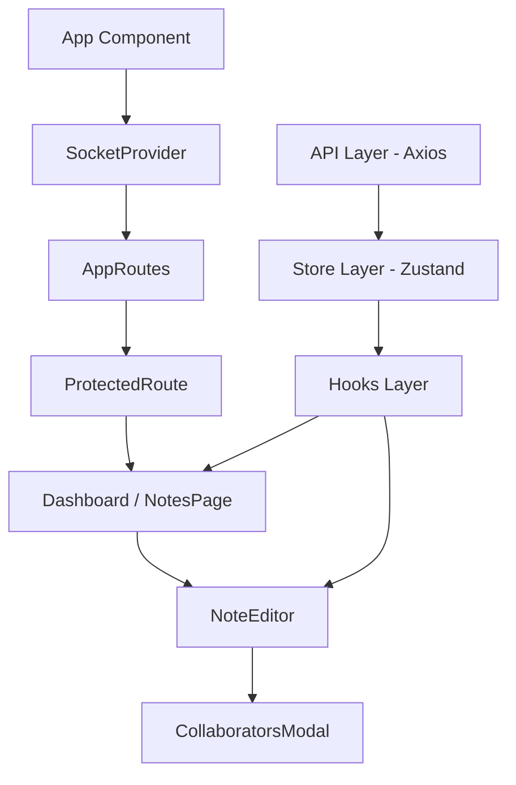

<<<<<<< HEAD
# Nebula-Notes
=======
# 🌌 Nebula Notes | Enterprise Collaboration Platform


Nebula Notes is a state-of-the-art, real-time collaborative platform designed for modern teams. Built with a "Nebula" aesthetic, it combines high-end glassmorphism design with a robust, production-ready React architecture.

## ✨ Core Features

### 🚀 Real-Time Synchronization
*   **Live Editing**: Multiple users can edit the same note simultaneously with sub-100ms synchronization via Socket.io.
*   **Presence Indicators**: See live avatars of team members currently active in any note.
*   **Instant Updates**: Changes to titles and content propagate across all connected clients instantly.

### 🔐 Enterprise-Grade Security
*   **RBAC (Role-Based Access Control)**: Granular permissions for **Admin**, **Editor**, and **Viewer** roles.
*   **Secure Auth**: JWT-based authentication with persistent sessions and automatic 401 handling.
*   **Protected Routes**: Advanced routing logic that prevents unauthorized access to sensitive pages.

### 📋 Collaborative Management
*   **Permission UI**: A dedicated interface to manage note access, invite collaborators by email, and assign specific roles.
*   **Activity Timeline**: A high-fidelity visual history of every workspace action—track who created, edited, shared, or deleted notes.
*   **Public Sharing**: Generate read-only public links for external stakeholders without requiring an account.

### 🎨 Premium User Experience
*   **Glassmorphism UI**: A sophisticated dark-mode design using blurred ambient light and translucent surfaces.
*   **Micro-animations**: Smooth, high-performance interactions powered by Framer Motion.
*   **Responsive Architecture**: Fully optimized for desktop, tablet, and mobile viewing.

---

## 🏗️ Technical Architecture

The project is architected for scalability and maintainability, following "Senior Frontend Architect" standards:



### Tech Stack
*   **Frontend**: React (Vite) + JavaScript
*   **Styling**: Tailwind CSS v4 + Framer Motion
*   **State**: Zustand (Scalable Slices)
*   **Real-time**: Socket.io-client
*   **Networking**: Axios (with Request/Response Interceptors)
*   **Icons**: Lucide React

---

## 🛠️ Getting Started

### 1. Installation
```bash
npm install
```

### 2. Configure Environment
Create a `.env` file from the provided example:
```bash
cp .env.example .env
```

### 3. Launch Development Environment
Run both the frontend and the mock backend simultaneously:

```bash
# Terminal 1: Vite Development Server
npm run dev

# Terminal 2: Mock API Server (json-server)
npm run server
```

## 👥 Default Test Users
| Name | Email | Password | Role |
| :--- | :--- | :--- | :--- |
| **Admin User** | `admin@test.com` | `123456` | `admin` |
| **Jane Doe** | `jane@example.com` | `password123` | `editor` |
| **Bob Smith** | `bob@example.com` | `password123` | `viewer` |

---
*Developed by the Nebula Team — Precision Engineering for Modern Collaboration.*
>>>>>>> b405167 (Initial commit - Nebula Notes App)
